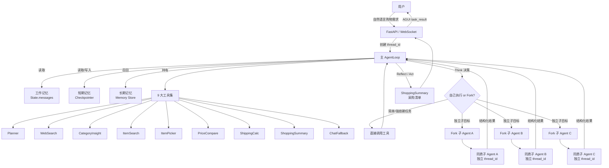
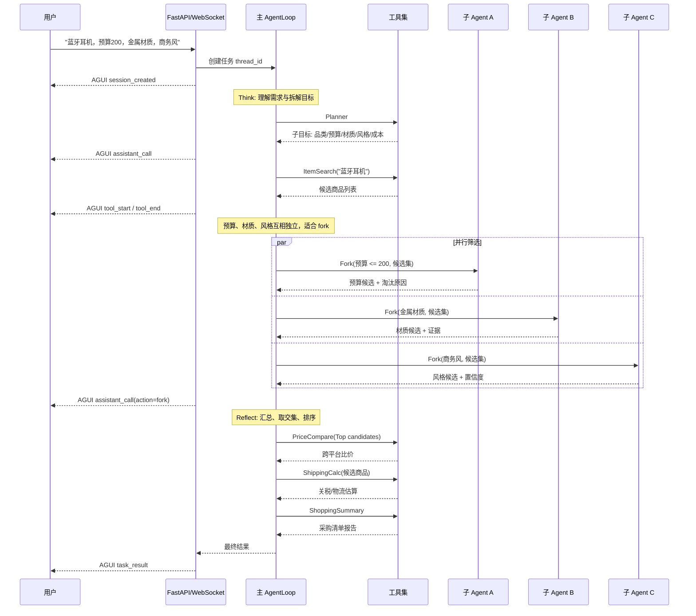
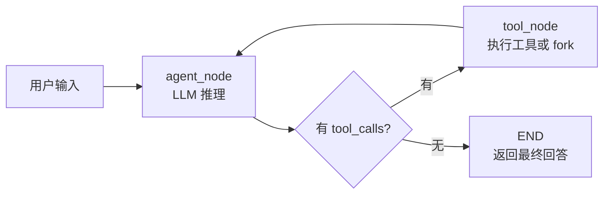
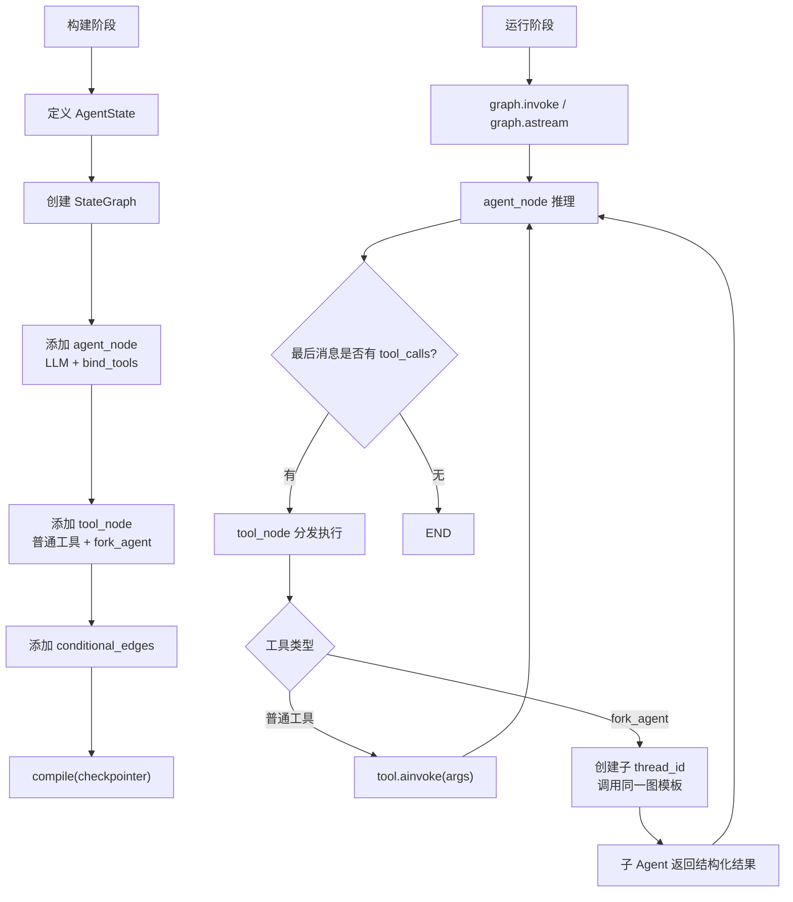
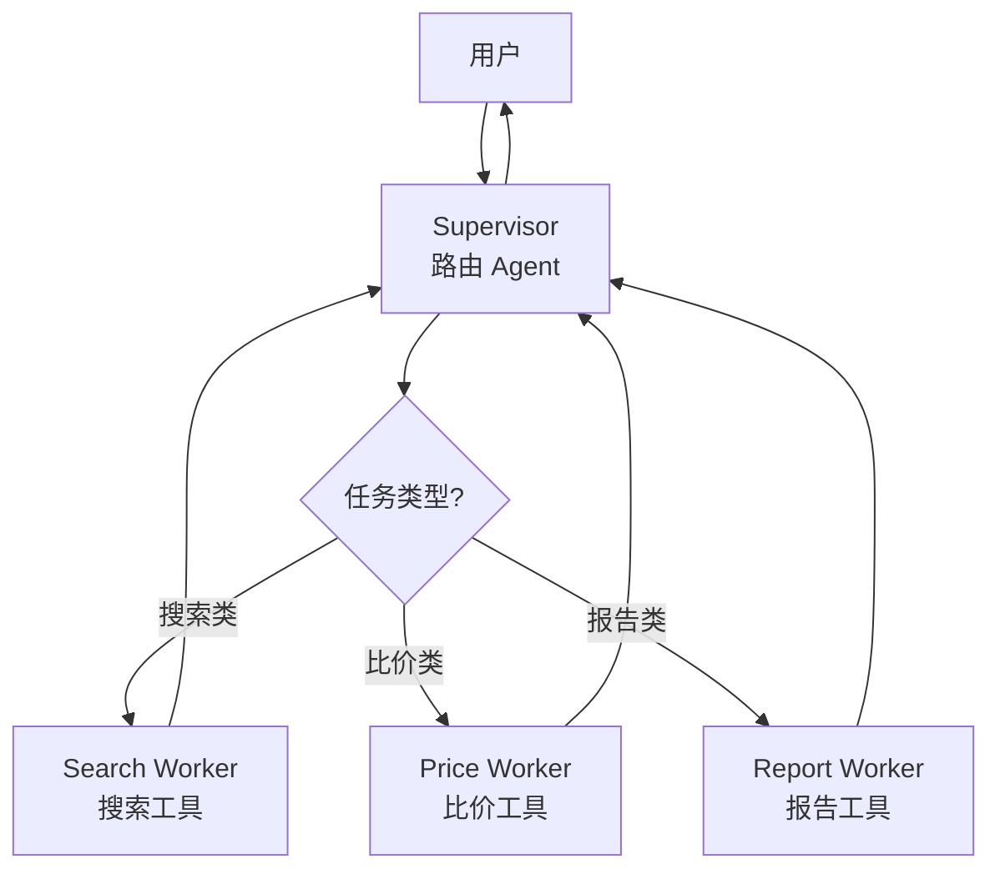
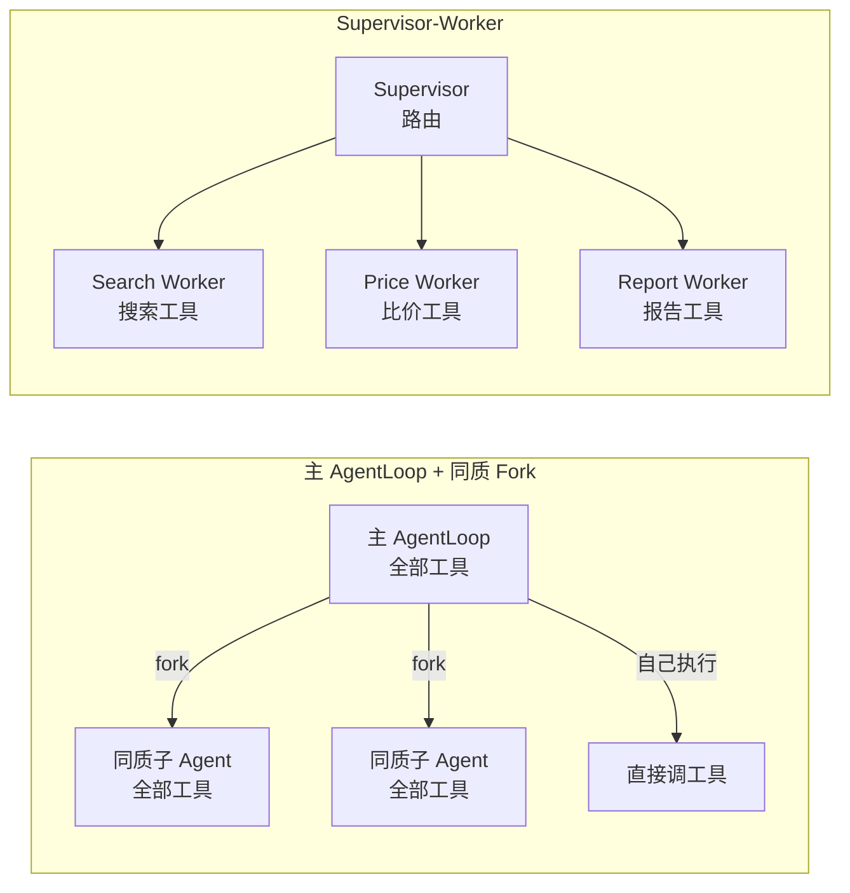

# Glodex Agent 架构设计

## 一、架构结论

Glodex Agent 采用 **主 AgentLoop + 同质 Fork** 架构，而不是传统的 Supervisor-Worker 架构。

一句话概括：**一个主 Agent 拥有完整工具能力；复杂任务按目标维度 fork 出多个同质子 Agent 并行处理；子 Agent 返回结构化结果后，由主 Agent 统一汇总、比价、输出采购清单。**

这个选择来自电商选品任务的本质：多数子任务不是“交给不同专家”，而是“对同一批候选商品施加不同约束”。例如预算、材质、风格、平台、物流成本，都是围绕候选集做筛选与补充信息。

### 1.1 核心约束

| 约束 | 说明 |
|------|------|
| 一个主循环 | 主 AgentLoop 保持全局视角，负责理解需求、规划、调度、汇总和最终回答 |
| 同一套工具 | 主 Agent 与子 Agent 使用同一套 9 大工具能力，避免为每个平台单独建 Worker |
| 独立上下文 | 每个 fork 子任务使用独立 `thread_id`，由 LangGraph Checkpointer 隔离短期记忆 |
| 结构化回传 | 子 Agent 不直接面向用户，只向主 Agent 返回筛选结果、证据、失败原因 |
| 可观测执行 | Agent 的思考、工具调用、fork、错误和最终结果都通过 AGUI 事件推送给前端 |

### 1.2 适用边界

同质 Fork 适合这些任务：

- 对同一候选集按不同条件并行筛选
- 对多个平台结果做统一归并与比价
- 对同一目标生成多个分析视角，再由主 Agent 汇总
- 子目标之间依赖少，可以并行执行

不适合这些任务：

- 子任务工具集完全不同，例如“写营销文案”和“跑财务风控”
- 子任务有强顺序依赖，必须一个结果喂给下一个
- 每个 Worker 都需要长期维护独立提示词、独立状态和独立权限

---

## 二、我们的架构：主 AgentLoop + 同质 Fork

### 2.1 核心思想

主 AgentLoop 是唯一面向用户的 Agent。它读取用户需求、工作记忆、短期记忆和长期记忆召回结果，然后决定下一步是自己调用工具，还是 fork 出子 Agent 并行处理子目标。

Fork 出来的子 Agent 是“同质”的：它们使用同一个 `StateGraph` 模板、同一套工具定义和同一类状态结构，只是输入任务、上下文和 `thread_id` 不同。

子 Agent 的职责不是替主 Agent 回答用户，而是完成一个清晰的子目标。例如“从候选集中筛掉预算超过 200 的商品”“找出金属材质候选”“判断商务风匹配度”。完成后，它们返回结构化结果，由主 Agent 做交集、排序、比价和总结。

### 2.2 架构图



### 2.3 典型时序



---

## 三、AgentLoop 执行模型

### 3.1 三阶段不是硬编码流程

Glodex 使用 Think → Reflect → Act 作为思考框架，但代码不应写成固定流水线。它应该由 LangGraph 的条件路由驱动，让 LLM 根据当前状态选择下一步工具。

| 阶段 | 主要问题 | 常见工具 |
|------|----------|----------|
| Think | 用户到底要什么？要先搜什么？是否要拆子任务？ | `Planner` / `CategoryInsight` / `ItemSearch` / `WebSearch` |
| Reflect | 候选是否足够？哪些商品符合偏好？是否需要 fork 交叉筛选？ | `ItemPicker` / `PriceCompare` / `fork_agent` |
| Act | 信息是否完整？是否要算物流关税？能否输出采购清单？ | `ShippingCalc` / `ShoppingSummary` |

阶段是解释模型，不是代码分支。实际循环是：



### 3.2 AgentState

AgentState 是 LangGraph 图里流动的唯一状态容器。Phase 1 可以保持简洁，但字段语义要先稳定。

```python
class AgentState(TypedDict):
    messages: Annotated[list[BaseMessage], add_messages]
    context: dict[str, Any]
```

建议的 `context` 字段：

| 字段 | 说明 |
|------|------|
| `thread_id` | 当前主任务 ID，串联 API、WebSocket、输出目录和 Checkpointer |
| `user_profile` | 长期记忆召回出的用户偏好 |
| `candidate_items` | 当前候选商品池 |
| `fork_results` | 子 Agent 返回的结构化结果 |
| `constraints` | 从用户需求中提取的预算、品类、平台、材质等约束 |
| `trace` | 可选调试信息，记录关键决策和工具调用摘要 |

### 3.3 工具分层

不是所有“能力”都要暴露成 LLM tool call。

| 类型 | 工具 | 实现方式 |
|------|------|----------|
| 内部能力 | `Planner` / `ChatFallback` / `ItemPicker` / `ShoppingSummary` | 由提示词和 Agent 推理消化，不一定进入 `bind_tools` |
| 外部能力 | `WebSearch` / `CategoryInsight` / `ItemSearch` / `PriceCompare` / `ShippingCalc` | 做成 LangChain Tool，进入 `llm.bind_tools()` |
| 编排能力 | `fork_agent` | 不是业务工具，而是 tool_node 中的特殊调度入口 |

这个分层能避免工具列表膨胀。内部能力更像 Agent 的“思考动作”，外部能力才是需要真实 I/O、重试、超时和错误处理的工具。

---

## 四、Fork 协议

### 4.1 什么时候 Fork

主 Agent 满足以下条件时才 fork：

| 条件 | 判断 |
|------|------|
| 子目标清晰 | 可以写成一句独立任务描述 |
| 输入足够 | 子 Agent 拿到候选集或必要上下文后能独立完成 |
| 互不强依赖 | 子任务之间不需要严格顺序执行 |
| 收益大于成本 | 并行能明显减少耗时，或多视角分析能提高质量 |

不应 fork 的情况：

- 候选集还没拿到，子 Agent 无事可做
- 子目标依赖另一个子目标的输出
- 只是一次普通工具调用，例如单次 `PriceCompare`
- 子任务太小，fork 的上下文与调度成本超过收益

### 4.2 fork_agent 入参

`fork_agent` 是主 Agent 可调用的特殊工具。它不直接访问外部 API，而是创建一个新的子图执行实例。

```json
{
  "task": "从候选集中筛选预算不超过 200 元的蓝牙耳机",
  "goal": "budget_filter",
  "input": {
    "candidate_items_ref": "state.context.candidate_items",
    "constraints": { "budget_max": 200 }
  },
  "expected_output": "返回符合条件的 item_id 列表、淘汰原因摘要、置信度",
  "timeout_ms": 8000
}
```

### 4.3 子 Agent 返回结构

子 Agent 的输出必须结构化，不能只返回自然语言段落。

```json
{
  "goal": "budget_filter",
  "status": "ok",
  "matched_item_ids": ["item_001", "item_008", "item_021"],
  "rejected": [
    { "item_id": "item_003", "reason": "价格 269 超出预算" }
  ],
  "evidence": [
    { "item_id": "item_001", "field": "price", "value": 189 }
  ],
  "confidence": 0.92,
  "summary": "50 个候选中有 15 个满足预算约束"
}
```

失败时也必须结构化：

```json
{
  "goal": "style_filter",
  "status": "partial",
  "matched_item_ids": [],
  "error": {
    "code": "INSUFFICIENT_PRODUCT_FIELDS",
    "message": "候选商品缺少材质或风格字段，无法稳定判断"
  },
  "summary": "无法完成风格筛选，建议回退到主 Agent 直接判断"
}
```

### 4.4 结果合并

主 Agent 收到多个 fork 结果后，按以下顺序合并：

1. 过滤掉 `status = failed` 且不可恢复的结果。
2. 对 `partial` 结果降权，但保留其证据和错误原因。
3. 对多个 `matched_item_ids` 做交集或加权排序，取决于约束类型。
4. 将淘汰原因保留到 `context.fork_results`，供最终报告解释。
5. 若交集为空，放宽低优先级约束，向用户说明取舍。

---

## 五、LangGraph 实现映射

### 5.1 图结构



### 5.2 概念对应

| 架构概念 | LangGraph 对应 |
|----------|----------------|
| 主 AgentLoop | 编译后的 `StateGraph` |
| agent_node | 读取 `messages/context`，调用 `llm.bind_tools(tools)` |
| tool_node | 遍历 `tool_calls`，分发普通工具或 `fork_agent` |
| route | 基于最后一条 AIMessage 是否存在 `tool_calls` 判断 |
| 同质子 Agent | 同一个图模板 + 不同 `thread_id` + 不同初始 state |
| 短期记忆隔离 | Checkpointer 以 `thread_id` 隔离状态 |
| 长期记忆 | 执行前从 Memory Store recall，写入 `context.user_profile` |
| 实时推送 | `graph.astream` 事件映射为 AGUI 事件 |

### 5.3 伪代码

```python
class GlodexAgent:
    def _build(self):
        llm_with_tools = self.llm.bind_tools(self.external_tools + [fork_agent])

        builder = StateGraph(AgentState)
        builder.add_node("agent", self._agent_node(llm_with_tools))
        builder.add_node("tools", self._tool_node)
        builder.set_entry_point("agent")
        builder.add_conditional_edges(
            "agent",
            self._route,
            {"tools": "tools", END: END},
        )
        builder.add_edge("tools", "agent")
        return builder.compile(checkpointer=self.checkpointer)

    async def _tool_node(self, state: AgentState):
        tool_messages = []
        for call in state["messages"][-1].tool_calls:
            if call["name"] == "fork_agent":
                result = await self._fork_sub_agent(call["args"], state)
            else:
                result = await self._invoke_external_tool(call)
            tool_messages.append(to_tool_message(call, result))
        return {"messages": tool_messages}

    async def _fork_sub_agent(self, args: dict, parent_state: AgentState):
        child_thread_id = new_child_thread_id(parent_state["context"]["thread_id"])
        child_state = {
            "messages": [HumanMessage(content=args["task"])],
            "context": {
                "thread_id": child_thread_id,
                "parent_thread_id": parent_state["context"]["thread_id"],
                "candidate_items": parent_state["context"].get("candidate_items", []),
                "constraints": args.get("input", {}).get("constraints", {}),
            },
        }
        config = {"configurable": {"thread_id": child_thread_id}}
        child_result = await self.graph.ainvoke(child_state, config)
        return parse_sub_agent_result(child_result)
```

### 5.4 同质 Fork 与注册表的关系

Phase 1 推荐先实现“同图模板 fork”：主 Agent 和子 Agent 复用同一个 `GlodexAgent.graph`。

`SubAgentRegistry` 可以保留，但它更适合后续演进为“少量异构专家”。如果一开始就把预算筛选、材质筛选、风格筛选都做成不同类，会把同质 Fork 退化成 Supervisor-Worker。

建议：

| 阶段 | 做法 |
|------|------|
| Phase 1 | `fork_agent` 使用同一个图模板，只改变 task/context/thread_id |
| Phase 2 | 如果某些子任务长期稳定且提示词差异很大，再注册专用 SubAgent |
| Phase 3 | 若专用 SubAgent 变多，再考虑 Supervisor-Worker 或混合架构 |

---

## 六、AGUI 观测点

架构层需要明确哪些内部动作会变成前端事件。否则后端可观测性和 UI 状态会脱节。

| Agent 动作 | AGUI 事件 | 说明 |
|------------|-----------|------|
| 创建主任务 | `session_created` | 返回 `thread_id`，前端建立任务视图 |
| LLM 开始一轮决策 | `assistant_call` | `action` 可为 `call_tool` / `fork` / `respond` |
| 普通工具开始 | `tool_start` | 包含工具名、入参摘要、`call_id` |
| 普通工具结束 | `tool_end` | 包含耗时、成功状态、结果摘要 |
| fork 子 Agent | `assistant_call` | `action=fork`，包含子目标列表 |
| 子 Agent 结束 | `tool_end` | 可用 `tool_name=fork_agent` 表示 fork 汇总结果 |
| 可恢复错误 | `error` | `recoverable=true`，主 Agent 继续降级执行 |
| 最终输出 | `task_result` | 包含采购清单、推荐理由、报告地址 |

---

## 七、失败与降级策略

### 7.1 普通工具失败

| 失败类型 | 处理方式 |
|----------|----------|
| 超时 | 标记工具结果为失败，允许主 Agent 使用已有信息继续 |
| 空结果 | 尝试改写查询词；仍为空则向用户说明覆盖不足 |
| 参数错误 | 由 tool_node 返回结构化错误，让 LLM 修正参数再试 |
| 第三方 API 错误 | 记录平台和错误码，降级到其他平台结果 |

### 7.2 Fork 失败

Fork 失败不应拖垮整个主任务。

| 失败类型 | 处理方式 |
|----------|----------|
| 单个子 Agent 超时 | 主 Agent 忽略该维度或降权处理 |
| 多个子 Agent 都失败 | 回退为主 Agent 串行筛选 |
| 子 Agent 输出无法解析 | 作为 `partial`，只保留自然语言摘要 |
| 子 Agent 陷入循环 | 限制最大轮次，返回 `FORK_MAX_ROUNDS_EXCEEDED` |

### 7.3 结果冲突

多个子 Agent 可能给出冲突判断。例如材质 Agent 认为某商品是金属，风格 Agent 认为它不适合商务。

主 Agent 的合并原则：

- 硬约束优先：预算、地区、库存、物流可达性
- 软约束排序：风格、品牌偏好、外观、主观匹配度
- 证据优先：有明确商品字段或来源的判断，高于纯推测
- 用户偏好优先：长期记忆中的强偏好高于默认排序

---

## 八、Supervisor-Worker 备选模式

### 8.1 核心思想

Supervisor-Worker 是另一个常见多 Agent 模式：一个 Supervisor 只负责路由，多个异构 Worker 分别负责不同领域。每个 Worker 有自己的工具、提示词和状态图。



### 8.2 为什么本项目不优先采用

Glodex 的 Phase 1 目标是跑通完整购物场景，而不是维护多个长期异构 Agent。若一开始采用 Supervisor-Worker，会出现三个问题：

1. 每个 Worker 都要单独维护提示词、工具列表、状态结构和测试。
2. Supervisor 自己不干活，容易丢失全局采购判断，只变成路由器。
3. 搜索、筛选、比价在电商场景里高度耦合，强行拆 Worker 会增加上下文传递成本。

Supervisor-Worker 不是错误架构，只是不适合作为当前主架构。后续如果出现真正异构的能力，例如“供应商谈判 Agent”“评论情感分析 Agent”“营销文案 Agent”，可以局部引入。

---

## 九、两种架构对比



| 维度 | 主 AgentLoop + 同质 Fork | Supervisor-Worker |
|------|--------------------------|-------------------|
| 子 Agent 定义 | 一个图模板，按任务动态 fork | 多个 Worker，每个都要单独定义 |
| 工具复用 | 所有实例复用同一套工具 | 工具分散到不同 Worker |
| 上下文隔离 | 不同 `thread_id` 隔离 | 常见实现共享 state，容易污染 |
| 并行能力 | 子目标可自然并行 | 常见 supervisor 是逐轮路由 |
| 主 Agent 角色 | 既能干活，也能决策和汇总 | 主要做路由 |
| 扩展成本 | 新场景通常增加子目标描述 | 新场景常要增加 Worker 类 |
| 适合场景 | 同一任务的多维度并行分析 | 完全不同能力域之间路由 |
| 本项目适配度 | 高 | 中，后续可局部引入 |

---

## 十、Phase 1 实现清单

第一阶段只需要实现能跑通的最小闭环。

### 10.1 必须完成

- `AgentState`：包含 `messages` 和 `context`
- 主 `StateGraph`：`agent_node` → `tool_node` → 条件路由 → END
- 外部工具接入：至少 mock `ItemSearch`、`PriceCompare`、`ShippingCalc`
- `fork_agent`：使用同一个图模板创建子 `thread_id`
- 结果结构：子 Agent 返回 JSON，主 Agent 能解析并合并
- AGUI 映射：输出 `session_created`、`assistant_call`、`tool_start`、`tool_end`、`task_result`、`error`
- 防循环：主 Agent 和子 Agent 都设置最大轮次与超时

### 10.2 可以延后

- 专用 `SubAgentRegistry` 的复杂注册机制
- 真实第三方电商 API
- 复杂长期记忆写入策略
- 多模型路由
- Supervisor-Worker 混合架构

### 10.3 最小验收场景

输入：

```text
帮我找预算 200 以内的蓝牙耳机，金属材质，商务风，最好能比较不同平台价格。
```

期望执行链路：

```text
Planner
→ ItemSearch
→ fork_agent(预算筛选 / 材质筛选 / 风格筛选)
→ 合并候选
→ PriceCompare
→ ShippingCalc
→ ShoppingSummary
```

期望输出：

- 推荐 2-3 个商品
- 每个商品包含平台、价格、关键参数、物流/关税估计
- 明确说明为什么推荐、为什么淘汰其他候选
- 前端能看到完整 AGUI 事件流

---

## 十一、最终原则

Glodex Agent 的架构原则是：**任务统一，Agent 统一；目标可拆，执行可 fork；结果收敛，主 Agent 汇总。**

同质 Fork 让系统先保持简单：一个图模板、一套工具、一种状态结构。等真正出现异构能力，再引入专用子 Agent 或 Supervisor-Worker，而不是提前把系统拆散。
