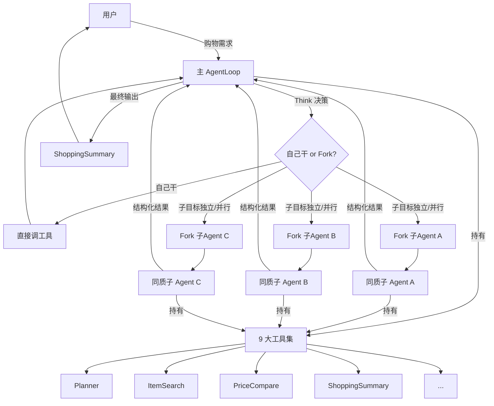
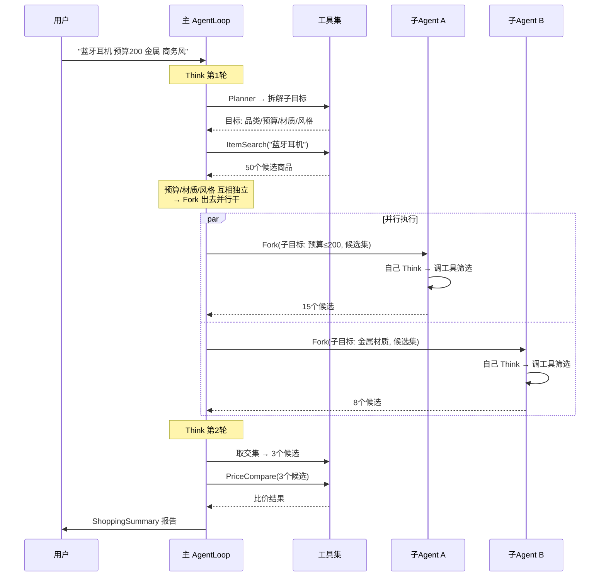
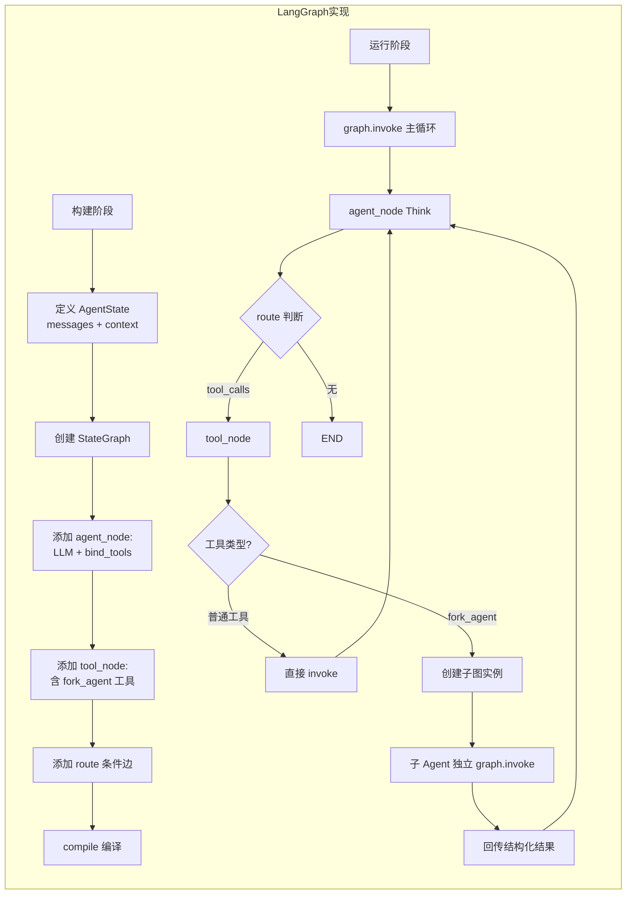
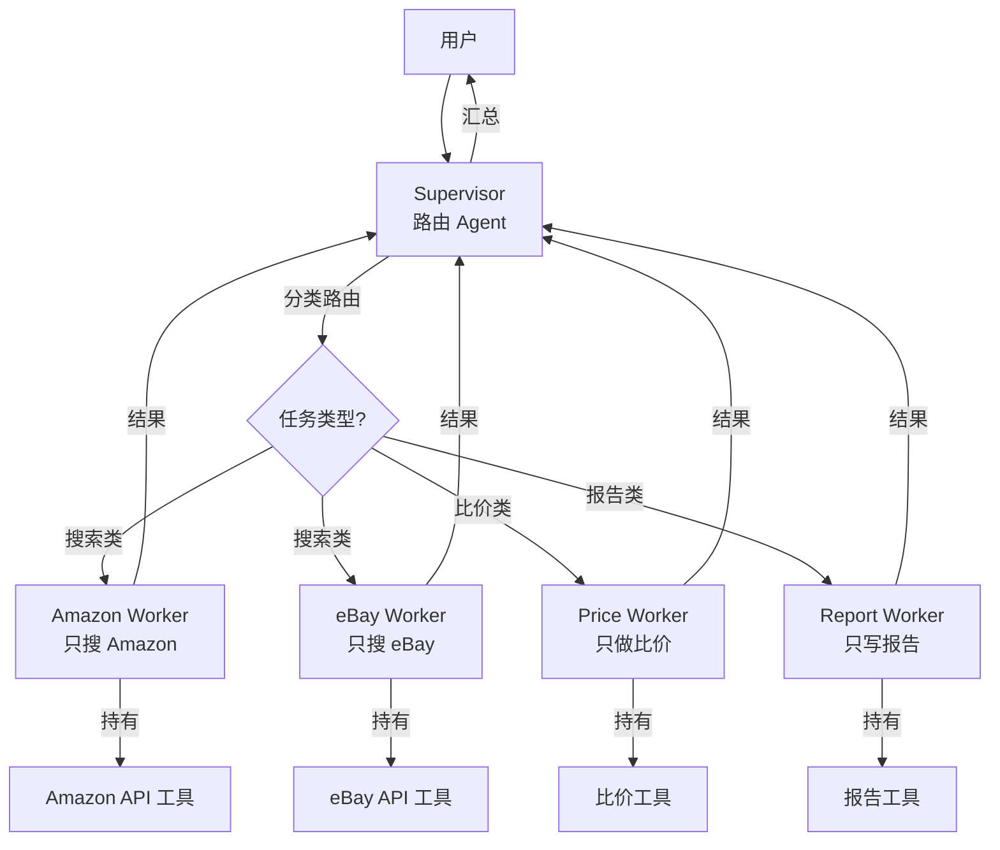
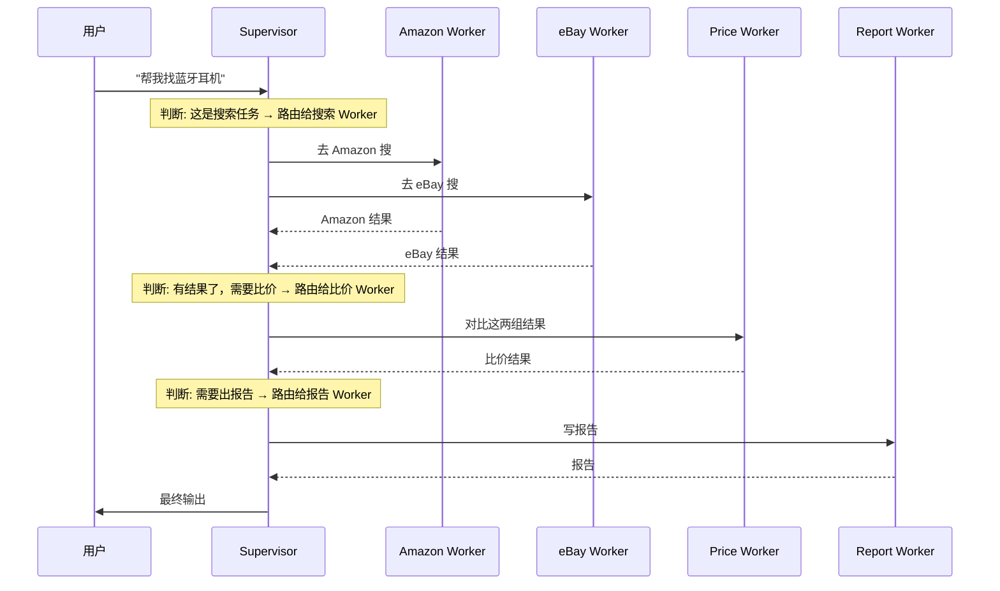
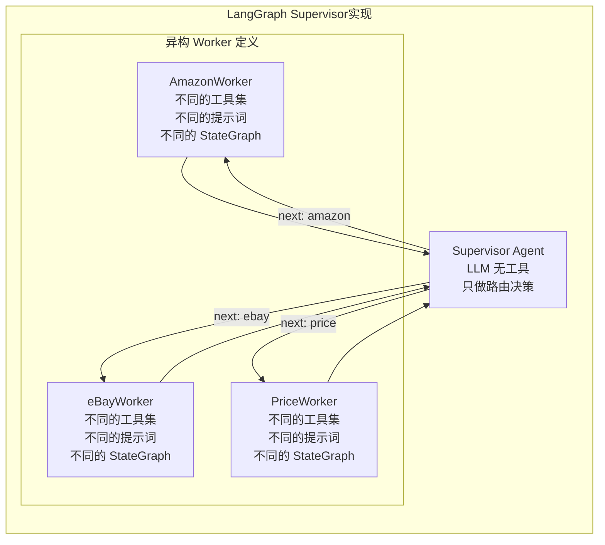
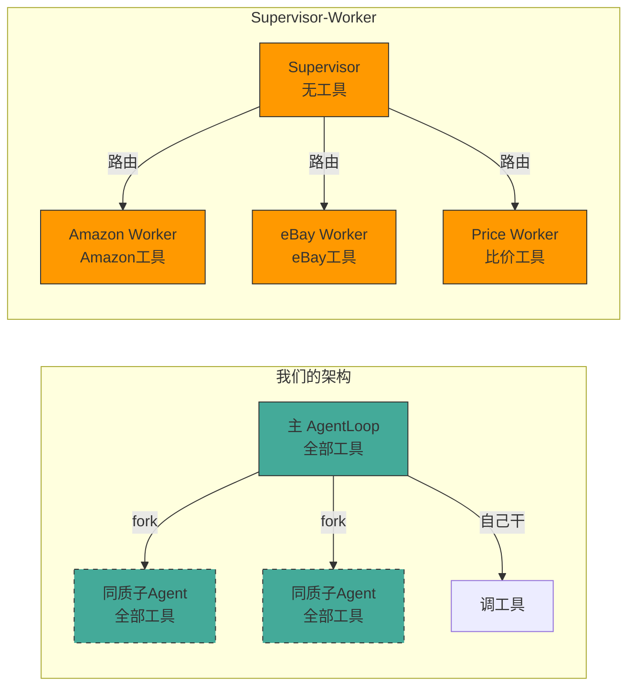

# Globex Agent 架构设计

## 一、我们的架构：主 AgentLoop + 同质 Fork

### 1.1 核心思想

一个主 AgentLoop 拥有全部工具能力。当任务复杂时，主 Agent **fork 出自己的克隆体**（同样的 9 个工具），给每个克隆体分配一个子目标，各自独立执行，结果回传给主 Agent。

### 1.2 架构图



### 1.3 时序



### 1.4 用 LangGraph 怎么做



**实现要点**：

| 概念 | LangGraph 对应 |
|------|---------------|
| 主 AgentLoop | 一个编译好的 `StateGraph` 实例 |
| agent_node | `llm.bind_tools(tools).invoke(messages)` |
| tool_node | 遍历 tool_calls，分发执行 |
| route | `hasattr(last_msg, "tool_calls")` 判断 |
| fork_agent | tool_node 中注册的特殊工具 |
| 同质子 Agent | **同一个 StateGraph 模板**，用不同 `thread_id` 创建独立实例 |
| 上下文隔离 | 不同 thread_id → 不同的 checkpointer 存储空间 |
| 结构化回传 | 子 Agent 的最终 `state.values["messages"]` 返回给主 Agent |

**伪代码**：

```
class GlobexAgent:
    _build():
        # 1. 定义一个 StateGraph 模板（这是主 Agent 和图 Agent 共用的）
        graph = StateGraph(AgentState)
            .add_node("agent", self._agent_node)
            .add_node("tools", self._tool_node)
            .add_edge("tools", "agent")
            .add_conditional_edges("agent", self._route)
            .compile()

    fork(task, context):
        # 2. Fork = 用同一个模板建子实例
        sub_agent_config = {"thread_id": new_unique_id()}
        sub_state = {"messages": [HumanMessage(task)], "context": context}
        return self.graph.invoke(sub_state, sub_agent_config)
```

---

## 二、另一种模式：Supervisor-Worker

### 2.1 核心思想

一个 Supervisor 管理多个**异构** Worker。每个 Worker 是不同领域的专家（不同工具、不同提示词）。Supervisor 不干活，只负责判断"这个任务该分给哪个 Worker"，然后路由过去。

### 2.2 架构图



### 2.3 时序



### 2.4 用 LangGraph 怎么做

LangGraph 官方提供了 `create_supervisor()` 来实现这个模式：



**实现要点**：

| 概念 | LangGraph 对应 |
|------|---------------|
| Supervisor | 一个没有工具的 LLM Agent，输出 `{next: "worker_name"}` |
| Worker | 多个**不同的** `StateGraph`，各有各的工具和提示词 |
| 路由 | Supervisor 的 conditional edge 按 `next` 值分发 |
| 结束 | Worker 任务完成 → 回归 Supervisor → 继续或 FINISH |
| 共享状态 | 所有 Worker 共用同一个 State，共享 messages |

---

## 三、对比

### 3.1 一图对比



### 3.2 优缺点

| 维度 | 主 AgentLoop + 同质 Fork（我们） | Supervisor-Worker |
|------|------|------|
| **子 Agent 定义** | 一个模板，零额外定义 | N 个 Worker，每个要定义工具+提示词+图 |
| **扩展成本** | 新场景 = 新的子目标描述 | 新场景 = 新 Worker 类 |
| **主节点角色** | 自己干活 + 决策 + 汇总 | 只路由，不干活 |
| **工具复用** | 天然复用，所有实例共享工具集 | 工具分散在各 Worker，可能重复 |
| **上下文管理** | 线程级隔离，每个实例独立 | 共享 State，上下文容易互相污染 |
| **并行能力** | Fork 即并行 | Supervisor 串行分发（一轮只能交给一个 Worker） |
| **适用场景** | 子目标**同构**（都是购物搜索的不同维度） | 子任务**异构**（搜索 vs 比价 vs 写报告，工具完全不同） |
| **实现复杂度** | 低 — 一个图模板搞定 | 高 — N 个图 + 路由逻辑 |
| **灵活性** | 高 — 主 Agent 动态决定 fork 几个 | 低 — Worker 种类和路由规则写死 |

### 3.3 为什么我们选同质 Fork

Globex Agent 的购物场景中：

- 品类筛选、预算筛选、材质筛选、风格筛选 — **本质上都是"给候选集加约束条件"**，用的是同一套工具（ItemSearch + 过滤逻辑）
- 子目标之间互不依赖，天然适合并行
- 不需要为 Amazon 写一个 Worker、为 eBay 再写一个 — ItemSearch 工具本身就屏蔽了平台差异
- 主 Agent 需要保持全局视野来出最终报告，不能只当路由器

**总结：任务统一 → Agent 统一。用 Fork 提供隔离和并行，而不是定义不同的 Agent 类型。**
