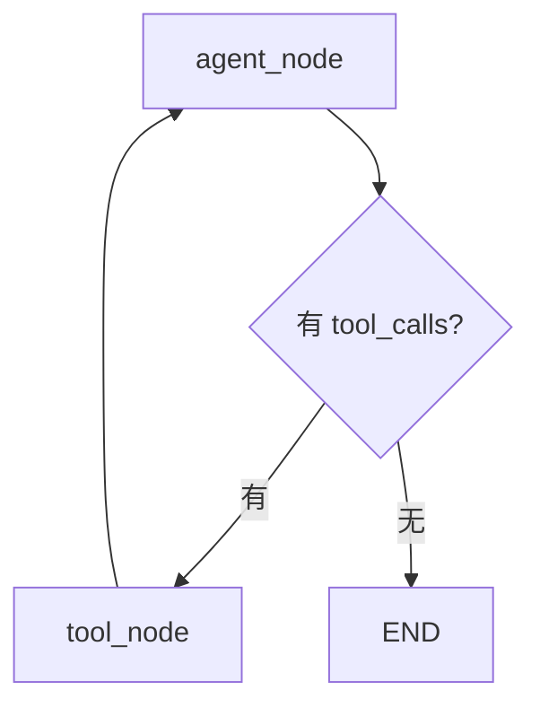
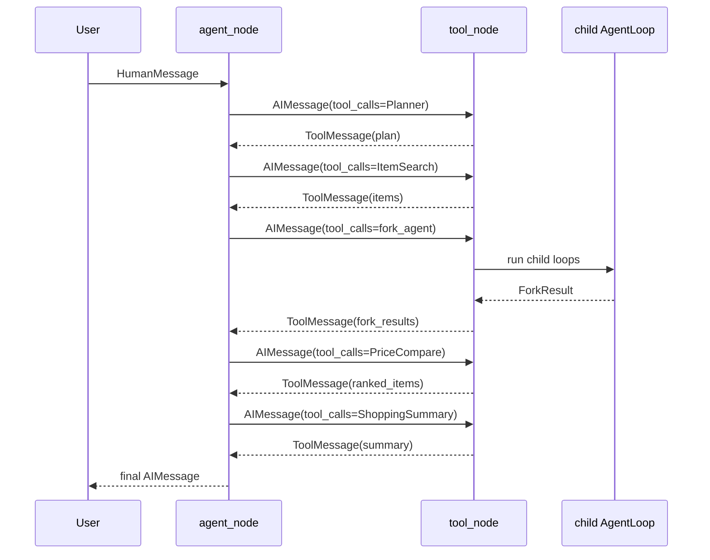

# LangChain 与 LangGraph API 使用说明

本文只记录 Glodex Agent 当前代码已经用到、或第二阶段已经接好的 LangChain / LangGraph API。它不是通用教程，而是给本项目后续开发看的“版本对齐说明”。

## 版本

项目当前锁定版本：

| 包 | 版本 | 来源 |
|----|------|------|
| `langgraph` | `1.2.6` | `pyproject.toml` / `requirements.txt` |
| `langchain` | `1.3.10` | `pyproject.toml` / `requirements.txt` |
| `langchain-openai` | `1.3.2` | `pyproject.toml` / `requirements.txt` |
| `langchain-core` | `1.4.8` | `uv.lock` 间接锁定 |

本项目实际直接 import 的核心 API 主要来自：

```python
from langgraph.graph import END, StateGraph
from langgraph.graph.message import add_messages
from langchain_core.messages import AIMessage, BaseMessage, HumanMessage, SystemMessage, ToolMessage
from langchain_core.tools import StructuredTool
from langchain_openai import ChatOpenAI
```

---

## 1. LangGraph: StateGraph

使用位置：[app/agent/main_agent.py](../app/agent/main_agent.py)

`StateGraph` 是 AgentLoop 的图编排入口。当前主图只有两个业务节点：

- `agent`：决定是否调用工具。
- `tools`：执行工具调用，并把结果写回 messages。

当前代码形状：

```python
builder = StateGraph(AgentState)
builder.add_node("agent", self._agent_node)
builder.add_node("tools", self._tool_node)

builder.set_entry_point("agent")
builder.add_conditional_edges(
    "agent",
    self._route,
    {
        "tools": "tools",
        END: END,
    },
)
builder.add_edge("tools", "agent")
graph = builder.compile()
```

对应流程：



关键 API：

| API | 当前用途 |
|-----|----------|
| `StateGraph(AgentState)` | 创建状态图，指定图中流动的状态类型 |
| `add_node(name, func)` | 注册节点函数 |
| `set_entry_point("agent")` | 设置图入口 |
| `add_conditional_edges(...)` | 根据 `_route` 的返回值选择下一跳 |
| `add_edge("tools", "agent")` | 工具执行后回到 Agent 继续思考 |
| `compile()` | 编译成可执行 graph |
| `graph.invoke(state, config)` | 同步执行一次 AgentLoop |
| `END` | LangGraph 的结束节点标识 |

---

## 2. LangGraph: AgentState 与 add_messages

使用位置：[app/agent/state.py](../app/agent/state.py)

当前状态定义：

```python
class AgentState(TypedDict):
    messages: Annotated[list[BaseMessage], add_messages]
    context: AgentContext
```

`messages` 使用 `add_messages`，含义是：节点返回新的消息时，不覆盖旧消息，而是追加到原消息列表。

例如：

```python
return {"messages": [AIMessage(content="...")]}
```

LangGraph 会把这条 `AIMessage` 追加到已有 `messages` 后面。

如果不用 `add_messages`，每个节点返回 `messages` 时容易覆盖历史消息，AgentLoop 就无法看到上一轮工具结果。

---

## 3. LangChain Core: Message 类型

使用位置：

- [app/agent/main_agent.py](../app/agent/main_agent.py)
- [app/agent/state.py](../app/agent/state.py)

当前用到的消息类型：

| 类型 | 用途 |
|------|------|
| `BaseMessage` | 所有消息的基础类型，用于类型标注 |
| `SystemMessage` | 系统提示词，定义 Agent 行为 |
| `HumanMessage` | 用户输入 |
| `AIMessage` | Agent 输出；也可以携带 `tool_calls` |
| `ToolMessage` | 工具执行结果，写回 messages 给 Agent 继续推理 |

初始化主任务时：

```python
initial_state = {
    "messages": [
        SystemMessage(content=self.system_prompt),
        HumanMessage(content=task),
    ],
    "context": create_initial_context(thread_id=actual_thread_id),
}
```

Agent 需要调用工具时，返回带 `tool_calls` 的 `AIMessage`：

```python
AIMessage(
    content="需要搜索商品候选集。",
    tool_calls=[
        {
            "name": "ItemSearch",
            "args": {"query": "..."},
            "id": "call_xxx",
        }
    ],
)
```

工具执行后，返回 `ToolMessage`：

```python
ToolMessage(
    content=json.dumps(result, ensure_ascii=False),
    tool_call_id=tool_call["id"],
    name=name,
)
```

`tool_call_id` 必须对应原始 tool call 的 `id`，这样模型才能知道这条工具结果属于哪次调用。

---

## 4. LangChain Core: tool_calls

当前第一阶段 mock 模式中，`tool_calls` 由代码手动构造：

```python
AIMessage(
    content=reason,
    tool_calls=[
        {
            "name": name,
            "args": args,
            "id": call_id,
        }
    ],
)
```

第二阶段 LLM 模式中，`tool_calls` 应由模型产生：

```python
response = self.llm_with_tools.invoke(state["messages"])
```

无论来源是 mock 决策器还是真实 LLM，`tool_node` 都统一读取：

```python
last_message = state["messages"][-1]
tool_calls = getattr(last_message, "tool_calls", []) or []
```

路由判断也是基于这个字段：

```python
return "tools" if tool_calls else END
```

---

## 5. LangChain Core: StructuredTool

使用位置：[app/tools/langchain_tools.py](../app/tools/langchain_tools.py)

`StructuredTool` 用来把 Python 函数包装成 LLM 可见的工具定义。当前这些工具主要用于 `llm.bind_tools(...)`，让模型知道有哪些工具、每个工具需要什么参数。

示例：

```python
StructuredTool.from_function(
    name="ItemSearch",
    description="搜索商品候选集。第一阶段返回 mock 商品，后续可替换真实电商 API。",
    args_schema=ItemSearchInput,
    func=lambda query: _schema_only_tool_result("ItemSearch", {"query": query}),
)
```

当前工具列表：

| 工具名 | args_schema | 说明 |
|--------|-------------|------|
| `Planner` | `PlannerInput` | 解析需求和约束 |
| `ItemSearch` | `ItemSearchInput` | 搜索商品候选 |
| `fork_agent` | `ForkAgentInput` | 创建同质子 AgentLoop |
| `FilterItems` | `FilterItemsInput` | 子 Agent 筛选候选商品 |
| `PriceCompare` | `EmptyToolInput` | 合并 fork 结果并比价 |
| `ShoppingSummary` | `EmptyToolInput` | 生成最终采购建议 |

注意：当前 `StructuredTool` 的函数体不是实际业务执行入口。真正执行仍在 [app/agent/main_agent.py](../app/agent/main_agent.py) 的 `_dispatch_tool()` 中完成。

也就是说：

```text
StructuredTool 负责告诉模型“工具长什么样”
_dispatch_tool 负责真正执行工具
```

---

## 6. LangChain OpenAI: ChatOpenAI

使用位置：[app/agent/llm.py](../app/agent/llm.py)

`ChatOpenAI` 是 OpenAI 兼容模型客户端。我们通过它接 DeepSeek、阿里百炼、豆包等 OpenAI 格式接口。

当前工厂函数：

```python
return ChatOpenAI(
    model=settings.model,
    base_url=settings.base_url,
    api_key=settings.api_key,
    temperature=settings.temperature,
    max_tokens=settings.max_tokens,
)
```

配置来源不写死在代码里。读取顺序：

1. 系统环境变量。
2. `GLODEX_LLM_ENV_FILE` 指向的外部 `.env` 文件。
3. 项目根目录 `.env`。

相关变量：

```env
GLODEX_AGENT_MODE=mock
LLM_MODEL=deepseek-chat
LLM_BASE_URL=https://api.deepseek.com
LLM_API_KEY=
LLM_TEMPERATURE=0
LLM_MAX_TOKENS=2048
```

`LLM_API_KEY` 不应提交到仓库。

---

## 7. ChatOpenAI.bind_tools

使用位置：[app/agent/main_agent.py](../app/agent/main_agent.py)

第二阶段新增的 LLM 模式会执行：

```python
self.tools = get_langchain_tools()
self.llm = self.llm or get_llm()
self.llm_with_tools = self.llm.bind_tools(self.tools)
```

之后 Agent 节点调用：

```python
return self.llm_with_tools.invoke(state["messages"])
```

这一步的作用是：把工具 schema 交给模型，让模型在需要时返回 `AIMessage.tool_calls`。

Mock 模式与 LLM 模式的区别：

| 模式 | tool_calls 来源 | 是否需要 API Key |
|------|-----------------|------------------|
| `mock` | `_decide_next()` 手动构造 | 否 |
| `llm` | `llm.bind_tools(...).invoke(...)` 由模型返回 | 是 |

---

## 8. 当前主 AgentLoop 如何运行

当前主调用：

```python
agent = create_agent(mode="mock")
state = agent.run("帮我找预算200以内的金属商务蓝牙耳机")
```

核心执行过程：



---

## 9. 当前没有使用的 LangGraph API

这些 API 未来可能需要，但当前代码还没接：

| API / 能力 | 后续用途 |
|------------|----------|
| `checkpointer` | 短期记忆，把同一个 `thread_id` 的状态跨请求保存 |
| `graph.astream(...)` | 真正流式推送 AGUI 事件 |
| `StateGraph` 多条件复杂路由 | 后续拆分异常处理、人工中断、取消任务 |
| LangGraph prebuilt agents | 暂不使用，当前保持手写图，便于理解 AgentLoop |

---

## 10. 开发约定

后续改 AgentLoop 时遵守这几个约定：

1. 主图保持 `agent -> tools -> agent -> END`，不要退回固定流水线。
2. 新工具先定义 Pydantic schema，再加入 `get_langchain_tools()`。
3. 工具真实执行逻辑统一进 `_dispatch_tool()` 或它调用的函数。
4. `ToolMessage.tool_call_id` 必须对应原始 tool call 的 `id`。
5. 没有 API Key 时，`mode="mock"` 必须继续可运行。
6. 真实 LLM 配置只走环境变量或外部 `.env`，不要写进代码。
