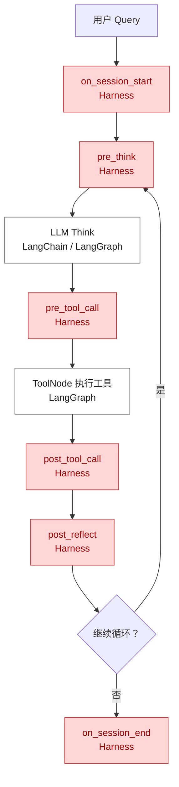

# Harness Hook：Agent 运行控制的基础知识

> 本文只说明通用概念、设计思想和 LangChain/LangGraph 承载方式。
> 不讨论 Glodex 当前代码现状、具体改造计划和 Silent Drift（静默漂移）检测。

## 1. Agent 与 Harness 的基本概念

一个面向业务的 LLM Agent，通常可以拆为四个模块：

| 模块 | 职责 | 例子 |
|---|---|---|
| 感知 | 接收和解析外部输入 | 文本、图片、文件、用户请求 |
| 记忆 | 保存、检索、压缩上下文与长期信息 | 对话历史、用户偏好、任务状态 |
| 大模型 | 理解意图、推理、规划下一步 | 选择工具、生成回复、决定是否结束 |
| 工具 | 执行外部动作 | 搜索、查询数据库、下单、调用 API |

工具只负责自己的业务能力。例如 `ItemSearch` 负责搜索商品，`PriceCompare` 负责比较价格；它们不应承担工具白名单、Token 预算、上下文截断、审计等通用控制责任。

**Harness** 是模型、记忆和工具之外的运行与治理层。它把上述模块组织成一个可控循环，并在关键位置处理：

- 允许模型看到哪些工具和上下文；
- 工具调用是否安全、参数是否合规；
- 工具结果怎样进入上下文；
- 任务是否陷入重复调用或超出预算；
- 何时写入记忆、何时审查最终输出；
- 如何记录 Trace、错误、成本和执行轨迹。

可以简化为：

```text
用户输入 → Harness 组织上下文 → LLM 决策 → Harness 管控工具调用
                                      ↓
                            工具执行与结果返回
                                      ↓
                         Harness 处理结果、状态和输出
```

Harness 不是某个模型，也不是某个工具；它是一层让 Agent 能稳定运行的工程基础设施。

## 2. 为什么需要 Harness Hook

Agent 的执行过程会反复经过相似的边界：模型调用前、工具调用前、工具返回后、任务结束前。很多规则都需要在这些边界上执行。

例如：

- 调用工具前，要检查工具是否在白名单、参数是否符合 Schema；
- 工具返回后，要截断过大结果、脱敏或校验返回格式；
- 模型再次思考前，要压缩过长上下文；
- 任务结束后，要写入长期记忆、审核最终输出、记录 Trace。

如果将这些逻辑直接散落在 Agent 主循环、每个工具、监控代码中，会出现三个问题：

1. 新增一条规则需要修改多个文件，且难以确认正确执行位置。
2. 同类逻辑容易重复，例如不同工具各自实现结果截断。
3. 规则的执行顺序、异常处理和观测方式不一致。

**Hook** 就是在生命周期的固定位置运行的一段可插拔逻辑。它负责检查、修改、拒绝或记录状态。

```text
工具即将执行
  → Hook：检查白名单、参数与权限
  → 工具执行
  → Hook：截断结果、脱敏、记录耗时
```

因此，Hook 解决的不是“工具如何搜索商品”，而是“所有工具调用如何被统一控制”。

Prompt 仍然有价值，例如告诉模型任务目标或可用工具；但确定性的规则不应只依赖 Prompt。是否在白名单、金额是否超限、JSON 是否合法、是否调用过某工具，都应由代码进行强制检查。

## 3. Hook Pipeline 的核心设计思想

一个具体 Hook 是一条单一职责规则，例如：

```text
工具白名单 Hook：检查当前工具是否允许调用
结果截断 Hook：限制工具返回的最大长度
循环检测 Hook：发现重复调用同一工具
```

**Hook Pipeline** 则是 Hook 的注册和调度中心。它负责：

1. 在什么生命周期节点运行 Hook；
2. 一个节点下有哪些 Hook；
3. Hook 按什么优先级依次执行；
4. Hook 修改后的状态如何传给下一条 Hook；
5. Hook 主动拒绝操作或意外报错时如何处理；
6. 如何记录每条 Hook 的执行耗时和结果。

它可以理解为三种常见设计模式的组合：

| 设计思想 | 在 Hook Pipeline 中的体现 |
|---|---|
| 策略模式 | 每条 Hook 是一个可替换的策略/规则 |
| 注册表模式 | Pipeline 保存“哪个节点有哪些 Hook” |
| 责任链模式 | 同一节点的多个 Hook 按顺序依次处理同一个上下文 |

概念结构如下：

```text
Harness Pipeline（总部）
│
├─ pre_tool_call
│  ├─ 工具白名单 Hook
│  ├─ 阶段状态机 Hook
│  └─ 参数 Schema Hook
│
└─ post_tool_call
   ├─ 工具结果截断 Hook
   ├─ 结果脱敏 Hook
   └─ Trace Hook
```

Pipeline 的核心接口可以抽象为：

```python
class HarnessPipeline:
    def register(hook_point, name, hook_fn, priority=100):
        """注册一条 Hook。"""

    async def run(hook_point, context):
        """按优先级运行某个节点下的全部 Hook。"""
```

其中 `context` 是在 Hook 之间流动的状态包，可包含：

```python
{
    "messages": [...],
    "tool_name": "ItemSearch",
    "tool_args": {"query": "降噪耳机"},
    "tool_result": "...",
    "phase": "search",
    "thread_id": "...",
}
```

每条 Hook 可有三种结果：

| 结果 | 含义 |
|---|---|
| 不修改，继续 | 只检查或记录，交给下一条 Hook |
| 修改 `context` | 例如将 `tool_result` 替换为截断后的结果 |
| 拒绝当前操作 | 例如工具不在白名单中，阻止真实工具执行 |

常见的注册方式是装饰器：

```python
@harness_hook("pre_tool_call", name="tool_whitelist", priority=10)
async def check_tool_whitelist(context):
    ...
```

它只是自动调用 `pipeline.register(...)` 的语法糖；真正执行仍发生在运行时调用：

```python
await pipeline.run("pre_tool_call", context)
```

## 4. Hook 生命周期：在 Agent Loop 的哪里触发

一个典型 Agent Loop 可抽象为以下六个 Hook 节点：

```text
用户 Query 进入
  → on_session_start

循环开始
  → pre_think
  → LLM Think：生成 tool_call 或最终回答
  → pre_tool_call
  → Tool 执行
  → post_tool_call
  → Observe：工具结果写回 State
  → post_reflect
循环结束

  → on_session_end
```

各节点的职责如下：

| Hook 点 | 触发时机 | 典型职责 |
|---|---|---|
| `on_session_start` | Agent 任务启动时 | 初始化会话状态、加载长期记忆、初始化预算 |
| `pre_think` | 每次调用 LLM 前 | 压缩上下文、注入记忆、注入 Token 收敛提示 |
| `pre_tool_call` | 真实工具执行前 | 白名单、权限、参数 Schema、阶段状态机检查 |
| `post_tool_call` | 真实工具执行后 | 结果截断、脱敏、结果格式校验、工具 Trace |
| `post_reflect` | 一轮 Agent 结果写回 State 后 | 循环检测、剩余预算检查、阶段状态推进 |
| `on_session_end` | Agent 任务结束时 | 记忆写回、最终输出审核、完整轨迹记录 |

这些节点是项目定义的业务语义，并不要求底层框架恰好使用完全相同的函数名。接入层可将它们映射到 LangChain Middleware 或 LangGraph 节点。

## 5. Hook 的分类：工具、记忆与通用治理

Hook 可按照能力归属分类；生命周期节点只是它们“在哪个时刻执行”。

### 5.1 工具模块 Hook

工具模块 Hook 管理“工具是否可以调用，以及返回结果如何被使用”。

| Hook | 建议节点 | 作用 |
|---|---|---|
| 工具白名单 | `pre_tool_call` | 只允许当前 Agent 使用允许的工具 |
| 权限检查 | `pre_tool_call` | 根据用户、角色、业务范围决定能否调用 |
| 参数 Schema 校验 | `pre_tool_call` | 校验工具名、必填参数、字段类型与取值范围 |
| 阶段状态机 | `pre_tool_call` | 限制当前阶段能执行的工具，例如未确认不能下单 |
| 工具结果截断 | `post_tool_call` | 避免超大返回结果挤占上下文 |
| 工具结果脱敏 | `post_tool_call` | 清除密钥、个人信息或不应进入模型上下文的字段 |
| 工具 Trace | `post_tool_call` | 记录工具名、耗时、结果大小、错误信息 |

工具本身仍只实现业务动作：搜索、比价、查订单、创建订单。通用控制不应散落在每个工具内部。

### 5.2 记忆与上下文 Hook

记忆模块 Hook 管理“什么进入模型上下文、什么长期保留”。

| Hook | 建议节点 | 作用 |
|---|---|---|
| 长期记忆加载 | `on_session_start` | 检索与当前请求相关的用户偏好、历史事实 |
| 记忆注入 | `pre_think` | 将必要记忆以受控长度加入系统提示或消息状态 |
| 上下文压缩 | `pre_think` | 对过长的 `messages` 做摘要、裁剪或断点压缩 |
| Session 快照 | `post_reflect` | 保存长任务当前状态，支持恢复和排障 |
| 长期记忆提取与写回 | `on_session_end` | 从已完成对话中提炼稳定偏好或有价值事实 |

这里的核心原则是：模型不应决定所有记忆操作；检索、压缩、写回应该在确定的生命周期节点由 Harness 管理。

### 5.3 通用治理 Hook

通用治理 Hook 不属于某个具体工具或记忆后端，负责整个 Agent 的安全、成本、流程和可观测性。

| Hook | 建议节点 | 作用 |
|---|---|---|
| LoopDetector | `post_reflect` | 发现短窗口内重复调用同一工具或等价动作 |
| Token/轮数预算 | `pre_think`、`post_reflect` | 控制最大轮数、工具调用次数和成本，必要时要求收敛 |
| 阶段状态推进 | `post_reflect` | 根据已验证事件推进或重置业务阶段 |
| 输出审核 | `on_session_end` | 检查最终格式、敏感信息、必要字段与合规要求 |
| Trace/指标 | 所有节点 | 记录 Hook、模型、工具的耗时、失败、拒绝与成本 |

治理规则应区分严格程度：

- 权限、白名单、金额上限等安全规则：检查失败时默认拒绝（fail closed）。
- Trace、统计等辅助规则：失败时记录日志但不阻断主任务。
- “是否真正满足用户意图”等语义问题：必要时才调用轻量 LLM 判断，避免将所有控制交给模型。

## 6. 单步验证：Hook 中具体检查什么

单步验证（Step Validation）是在每次工具调用或每轮执行过程中，及时验证当前步骤是否正常。它不同于端到端 Rubric 评测：

| 维度 | 单步验证 | 端到端 Rubric |
|---|---|---|
| 检查时机 | 每次工具调用前后或每轮后 | 整个任务结束后 |
| 检查粒度 | 单个工具调用的输入/输出 | 最终回答和完整任务质量 |
| 速度与成本 | 多为代码规则，快且便宜 | 常需 Judge LLM，较慢且较贵 |
| 主要作用 | 防止错误继续传播 | 判断最终任务是否真正成功 |

例如，第 2 轮工具返回了错误格式，如果只在任务结束后评测，后续多轮可能已经基于错误数据浪费了时间和 Token。单步验证要在错误产生时尽快记录、纠正、重试或阻止继续执行。

### 6.1 Schema Assertion：格式与结构验证

检查工具返回是否符合预期的数据结构：

- 是否为合法 JSON；
- 是否包含必填字段；
- 字段类型是否正确；
- 是否满足 Pydantic 或 JSON Schema。

它通常是纯代码验证，适合放在 `post_tool_call`。

```text
ItemSearch 返回结果
→ JSON 能否解析？
→ 是否存在 candidates 列表？
→ candidates 是否为预期对象结构？
```

### 6.2 Sequencing Assertion：调用顺序验证

检查当前工具调用是否满足前置步骤。

例如：

```text
ShoppingSummary 前，应先执行 ItemPicker；
PriceCompare 前，至少应先执行一次 ItemSearch。
```

通常：

- 在 `pre_tool_call` 检查当前调用是否缺少前置步骤；
- 在 `post_tool_call` 记录本次成功调用，供后续检查读取。

根据业务风险，顺序检查可以是：

- **硬拒绝**：不满足前置条件，禁止执行，例如未确认就支付；
- **软警告**：向模型注入提醒，让其补全步骤，例如尚未筛选商品就尝试总结。

### 6.3 Semantic Assertion：语义相关性验证

格式和顺序都正确，并不代表工具结果真的符合用户需求。

例如：

```text
用户：推荐 500 元内、适合通勤的降噪耳机。
工具：返回一组 2,000 元的游戏耳机。
```

此时 JSON 合法、调用顺序也正常，但结果与需求不匹配。Semantic Assertion 使用轻量 LLM 或语义模型判断：

```text
“当前工具返回，是否与原始用户请求相关？”
```

它通常放在 `post_tool_call`，但应只用于高价值、易偏离的工具，且限制输入长度和调用频率。

单步验证与端到端 Rubric 的关系是：

```text
单步验证：保证每一步尽量不出明显错误
端到端 Rubric：保证最终回答整体达到任务目标
```

二者互补，不能相互替代。

## 7. LangChain / LangGraph 如何承载 Hook

Hook Pipeline 是项目自主定义的控制抽象；LangChain 和 LangGraph 提供的是 Agent Loop、工具执行和可插入的框架入口。

### 7.1 Callback、Middleware 与 Harness Hook 的区别

| 概念 | 主要用途 |
|---|---|
| LangChain/LangGraph Callback | 观测事件，例如日志、Langfuse Trace、Token、耗时、错误 |
| LangChain Middleware | 在模型或工具调用前后介入，可包装、修改或阻止执行 |
| Harness Hook | 项目定义的统一控制规则；通过 Middleware 或图节点被调用 |

简单原则：

```text
只需要观察、不改变行为 → Callback
需要检查、修改、拒绝执行 → Harness Hook（通常经 Middleware/节点接入）
```

### 7.2 在 Agent 任务边界接入

会话级 Hook 可在 Agent 入口函数外层显式调用：

```python
async def run_agent(query, thread_id, user_id=None):
    await harness.run("on_session_start", {
        "query": query,
        "thread_id": thread_id,
        "user_id": user_id,
    })

    result = await agent.ainvoke(...)

    context = await harness.run("on_session_end", {
        "final_answer": result,
        "thread_id": thread_id,
    })
    return context.get("final_answer", result)
```

这类接入适合初始化、记忆读取、任务结束的输出审核和记忆写回。

### 7.3 在模型调用前接入

LangChain 的 Agent Middleware 提供模型调用前后的介入点。项目可将业务语义 `pre_think` 映射到 `before_model` 或包装模型调用的 Middleware。

```python
class HarnessAgentMiddleware(AgentMiddleware):
    async def abefore_model(self, state, runtime):
        context = await harness.run("pre_think", {
            "messages": state["messages"],
        })
        return {"messages": context["messages"]}
```

这里可以执行上下文压缩、记忆注入、Token 收敛提示等操作。

### 7.4 在统一工具入口接入

LangGraph 的 `ToolNode` 是预构建的统一工具执行节点。LLM 产生 `tool_call` 后，`ToolNode` 会按工具名称找到并执行具体工具。

为了不在每个工具中重复写前后控制，可通过两种方式接入：

1. 使用 LangChain 的 `wrap_tool_call` Middleware；
2. 在使用显式 LangGraph 图时，继承或包装 `ToolNode`。

其核心结构相同：

```python
class HarnessToolNode(ToolNode):
    async def _run_one_tool(self, tool_call, config):
        context = await harness.run("pre_tool_call", {
            "tool_name": tool_call["name"],
            "tool_args": tool_call["args"],
            "tool_call_id": tool_call["id"],
        })

        if context.get("_rejected"):
            return make_rejected_tool_result(context)

        result = await super()._run_one_tool(tool_call, config)

        context = await harness.run("post_tool_call", {
            "tool_name": tool_call["name"],
            "tool_result": result["content"],
        })
        result["content"] = context.get("tool_result", result["content"])
        return result
```

`super()._run_one_tool(...)` 代表保留 LangGraph 原有的“按名称查找并执行具体工具”的逻辑；子类只在前后包裹 Harness 控制。

因此所有工具会经过同一个统一入口：

```text
LLM 产生 ToolCall
  → HarnessToolNode
  → pre_tool_call Hook
  → LangGraph ToolNode 原始工具执行逻辑
  → post_tool_call Hook
  → 结果回到 LLM
```

具体工具无需知道白名单、预算、截断、审计等通用规则；它们只实现自己的业务功能。

### 7.5 运行时调用关系



这个图中的红色节点是项目需要定义和接入的 Harness 生命周期；白色节点由 LangChain/LangGraph 提供。

## 8. 语义漂移检测 Hook

语义漂移（Silent Drift）指的是：Agent 的每一次工具调用可能都没有报错、格式也正确，但经过多轮执行后，整体行为已逐渐偏离用户最初目标。

例如：

```text
用户目标：推荐 3 款 500 元内、适合通勤的降噪耳机。

第 1 轮：搜索耳机                → 正常
第 2 轮：比较耳机参数            → 正常
第 3 轮：搜索品牌历史            → 开始偏离
第 4 轮：搜索手机生态或其他品类  → 明显偏离
```

它和单步 `Semantic Assertion` 的区别是：

| | Semantic Assertion | 语义漂移检测 |
|---|---|---|
| 检查对象 | 一次工具返回是否与 Query 相关 | 多轮 Agent 行为是否仍在完成原始目标 |
| 常用节点 | `post_tool_call` | `post_reflect` |
| 输入 | 原始 Query + 本次工具结果 | 原始 Query + 最近多轮行为摘要 + 当前 State |
| 典型问题 | “这次搜索结果相关吗？” | “整个任务还在正确方向吗？” |

### 8.1 触发位置与检测节奏

漂移检测适合注册在 `post_reflect`：此时工具结果已经写回 Agent State，一轮执行结束，系统能看到连续多轮的行为。

```python
@harness_hook("post_reflect", name="drift_detector", priority=20)
async def detect_drift(context: dict) -> dict | None:
    ...
```

它不应每轮都调用模型。建议每 3～5 轮检查一次：

```text
每轮 post_reflect
  → 更新轮次和最近行为摘要
  → 未到检查间隔：直接结束
  → 到检查间隔：执行代码预检
  → 可疑时才调用轻量 LLM 确认
```

### 8.2 漂移检测需要维护哪些 State

语义漂移 Hook 的重点不只是“调用一次 LLM 判断”，而是持续维护足够的 State，使其能理解任务已经做了什么、当前偏离程度如何，以及下一轮需要怎样纠正。

建议状态分为四类：

| State 类别 | 推荐字段 | 用途 |
|---|---|---|
| 原始目标 | `original_query`、`task_constraints` | 保存用户最初需求、预算、数量、品类等不可丢失约束。 |
| 过程轨迹 | `round_count`、`recent_actions_summary`、`called_tools`、`recent_tool_results` | 保存最近几轮调用了哪些工具、参数摘要、阶段性结果。 |
| 风险信号 | `consecutive_empty_results`、`preference_violation_detected`、`token_usage` | 给代码预检提供确定性判断依据。 |
| 纠正状态 | `drift_detected`、`consecutive_severe_drift`、`inject_messages`、`phase` | 保存判断结果，并让下一轮 Agent 真正接收和执行纠正。 |

一个简化的 `context` 示例：

```python
{
    # 用户目标：整个任务期间都应保留
    "original_query": "推荐 3 款 500 元内、适合通勤的降噪耳机",
    "task_constraints": {
        "category": "降噪耳机",
        "budget_max": 500,
        "count": 3,
    },

    # 任务过程：每轮持续更新
    "round_count": 6,
    "phase": "search",
    "called_tools": ["item_search", "item_picker", "price_compare"],
    "recent_actions_summary": "最近三轮：搜索耳机；筛选预算 500 元内商品；比较价格。",
    "recent_tool_results": ["...摘要一...", "...摘要二..."],

    # 可由代码直接判断的风险信号
    "consecutive_empty_results": 0,
    "preference_violation_detected": False,
    "token_usage": {"used": 6200, "budget": 10000},

    # 漂移检测与纠正结果
    "drift_detected": "mild",       # normal / mild / severe
    "consecutive_severe_drift": 0,
    "inject_messages": [],
}
```

其中最重要的是 `recent_actions_summary`：它不应保存完整消息历史，而应保存最近几轮的紧凑摘要，例如“做了什么工具调用、得到什么关键结论、当前任务处于什么阶段”。这既足以支持检测，也避免将过多 Token 交给判定模型。

### 8.3 两阶段检测：代码预检 + LLM 语义确认

漂移检测需要语义理解，但绝不应该一上来就调用 LLM。推荐流程是：

```text
每 3～5 轮进入 post_reflect
  → 代码预检
  → normal：直接结束，不调用 LLM
  → suspicious：调用轻量 LLM
  → 输出：正常 / 轻微偏离 / 严重偏离
  → 修改 State 并进入下一轮
```

代码预检可使用以下信号：

| 信号 | 代码检测方式 | 示例触发条件 |
|---|---|---|
| 目标遗忘 | 原始 Query 关键词在最近行为摘要中的命中率 | 最近 3 轮命中率低于 20% |
| 探索发散 | 连续搜索是否没有有效结果 | 连续 3 次搜索结果为空 |
| 偏好丢失 | 推荐属性是否触犯长期记忆中的禁忌 | 命中用户明确排斥的品牌或属性 |
| 成本失控 | 当前 Token/轮数消耗是否异常 | 最近 3 轮平均 Token 超出预算或历史均值 |

预检只需给出两类结果：

```text
normal：没有可疑信号，不调用 LLM。
suspicious：出现至少一个可疑信号，交给轻量 LLM 确认。
```

轻量 LLM 只需要看到很少的信息：

```text
用户原始需求：{original_query}
最近 3 轮行为摘要：{recent_actions_summary}

请只回答：正常 / 轻微偏离 / 严重偏离。
```

### 8.4 判断后如何通过 State 纠正

漂移检测 Hook 不直接替 Agent 做任务。它负责将检测结果写入 State；下一轮的 `pre_think`、`pre_tool_call` 和阶段状态机读取 State，进而改变 Agent 可看到的提示和可执行的工具。

| 判断 | State 更新 | 后续纠正方式 |
|---|---|---|
| 正常 | 清空或降低漂移计数 | 正常继续执行。 |
| 轻微偏离 | `drift_detected = "mild"`；向 `inject_messages` 写入提醒 | 下一轮 `pre_think` 注入提醒，让模型主动回到原始目标。 |
| 严重偏离 | `drift_detected = "severe"`；`consecutive_severe_drift += 1` | 注入强纠正提示，并收紧 Token 或工具调用预算。 |
| 连续严重偏离 | `phase = "force_summary"` | `pre_tool_call` 禁止新的宽泛搜索，只允许总结/收尾动作。 |

轻微偏离的注入消息示例：

```text
提醒：你的行为有轻微偏离用户原始需求的倾向。
请确保下一步行动与原始 Query 直接相关。
```

严重偏离的注入消息示例：

```text
纠偏：当前行为已偏离用户原始需求。
请重新聚焦原始目标，并基于已有结果推进到筛选、比价或总结环节。
```

若连续两次严重偏离，不能只依赖一条“请收尾”的 Prompt。应通过确定性状态机保证：

```text
phase = force_summary
  → pre_tool_call 拒绝新的搜索工具
  → 仅允许 ShoppingSummary 等收尾工具
  → 或直接要求 Agent 基于已有结果输出结论
```

这才是代码级的纠正，而不是希望模型碰巧遵守提示。

### 8.5 成本与可靠性原则

语义漂移需要理解连续多轮的行为，因此可能使用 LLM；但应严格控制成本：

1. 每 3～5 轮检测一次，而不是每轮检测。
2. 优先运行代码预检；多数正常任务无需调用 LLM。
3. 只传原始需求和最近行为摘要，不传完整消息历史。
4. 使用轻量模型，并限制为固定分类输出。
5. 将 LLM 输出视为语义信号；安全、权限、预算与工具限制仍由确定性代码规则保证。

完整链路可以概括为：

```text
代码发现可疑信号
→ 轻量 LLM 判断偏离程度
→ 更新 State
→ 下一轮 Harness 通过提示、预算和工具限制完成纠正
```

## 9. 建议的 Harness 包结构

Harness 包不只是“许多 Hook 文件加一个注册器”。它还需要统一类型、Pipeline 调度、框架适配和应用装配层，避免具体 Hook 直接耦合 LangChain/LangGraph。

```text
app/
└─ harness/
   ├─ __init__.py
   │
   ├─ types.py
   │   # HookPoint、HookContext、HookFn、HookRejectSignal 等统一类型
   │
   ├─ pipeline.py
   │   # HarnessPipeline：register()、run()、优先级、异常处理
   │
   ├─ decorators.py
   │   # @harness_hook(...)：自动注册的语法糖
   │
   ├─ bootstrap.py
   │   # build_harness()：集中导入并注册首批 Hook
   │
   ├─ langchain_adapter.py
   │   # 继承 AgentMiddleware；
   │   # 将 before_model / wrap_tool_call 映射成 Harness 生命周期
   │
   └─ hooks/
       ├─ __init__.py
       │
       ├─ tool/
       │   ├─ allowlist.py
       │   ├─ schema_validation.py
       │   ├─ result_truncate.py
       │   ├─ sanitize.py
       │   └─ sequencing.py
       │
       ├─ memory/
       │   ├─ session_start.py
       │   ├─ context_compression.py
       │   ├─ memory_injection.py
       │   └─ memory_persistence.py
       │
       └─ governance/
           ├─ loop_detector.py
           ├─ token_budget.py
           ├─ phase_state.py
           ├─ output_guard.py
           └─ trace.py
```

各层职责如下：

| 位置 | 职责 |
|---|---|
| `types.py` | 统一生命周期节点、Hook 函数签名、Context 结构和拒绝信号，避免各 Hook 使用不一致的数据约定。 |
| `pipeline.py` | Hook 总部：保存注册表、按优先级运行 Hook、传递 Context，并统一处理拒绝和异常。 |
| `decorators.py` | 提供 `@harness_hook(...)` 注册语法糖；它只负责注册，不负责运行。 |
| `bootstrap.py` | 应用启动时集中装配 Hook，避免依赖“某个文件碰巧被 import 后才完成注册”。 |
| `langchain_adapter.py` | 框架翻译层：把 LangChain 的 `before_model`、`wrap_tool_call` 等入口转换为 `harness.run(...)`。 |
| `hooks/tool/` | 工具调用前后的横切控制：白名单、Schema、截断、脱敏、调用顺序。 |
| `hooks/memory/` | 记忆和上下文的生命周期控制：加载、压缩、注入、写回。 |
| `hooks/governance/` | 全局治理：循环检测、预算、阶段状态、输出审核和 Trace。 |

这里需要保持一个边界：

```text
hooks/*：决定何时检查、是否允许、如何修改 State。
memory/*、tools/*：继续实现真正的压缩、存储、检索、搜索、比价等业务能力。
```

因此，Hook 是编排和控制层，而不是把所有业务代码重新复制一遍。
